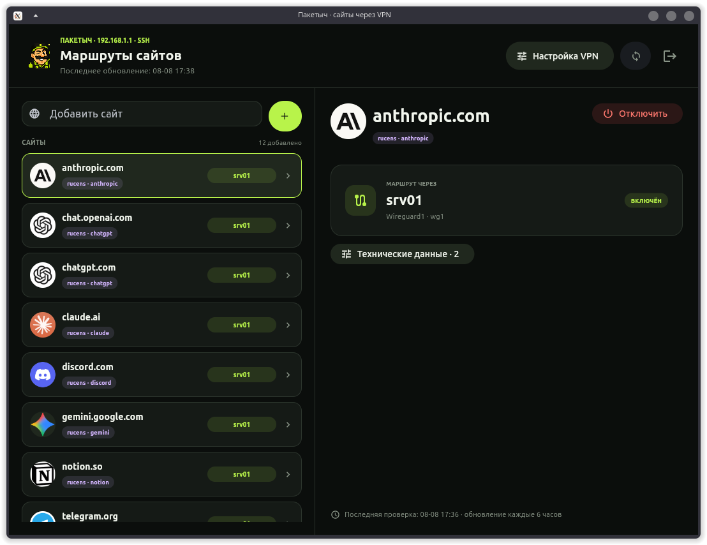
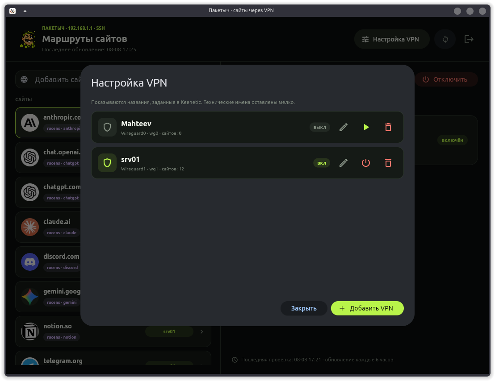
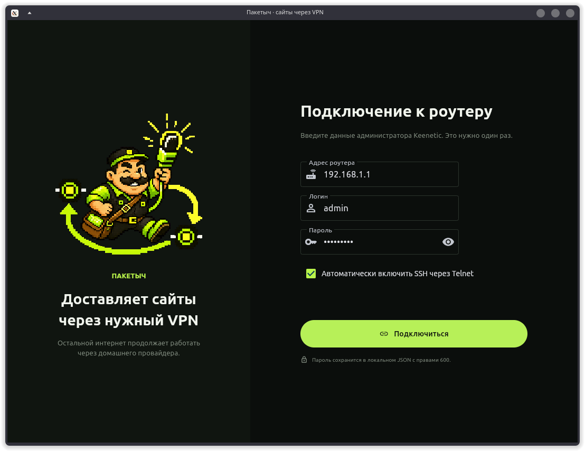
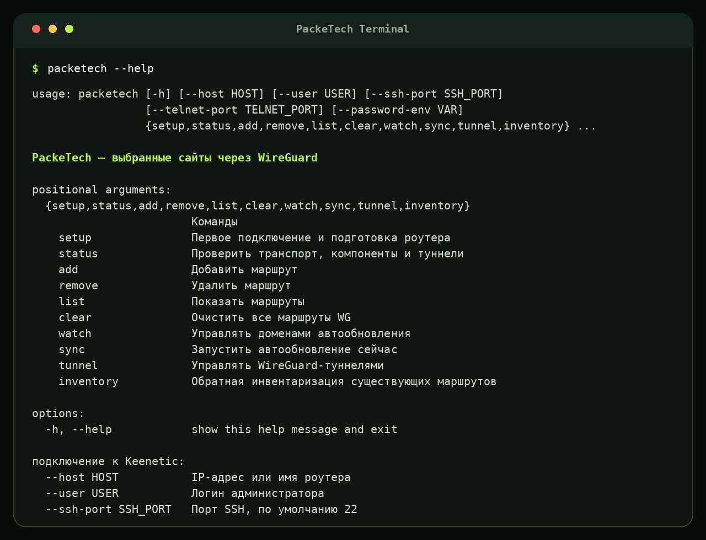
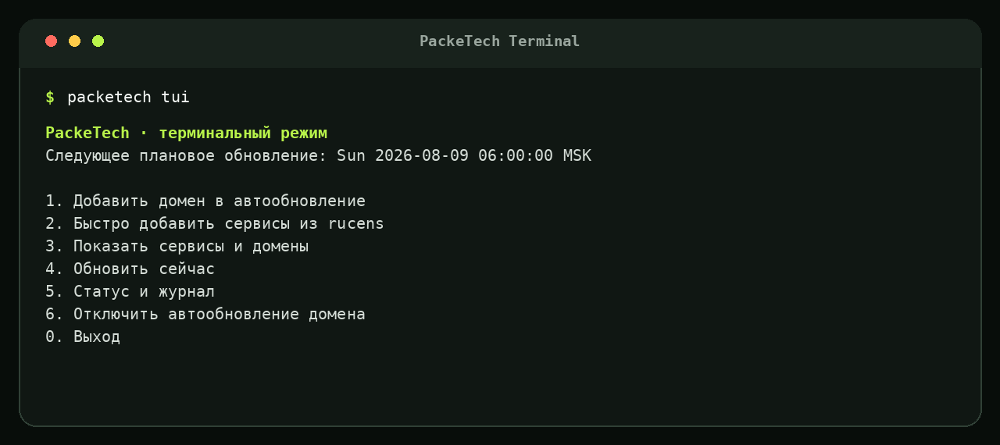

<p align="center">
  
</p>

<h1 align="center">PackeTech</h1>

<p align="center">
  <strong>Отправляет выбранные сайты через WireGuard. Остальной интернет не трогает.</strong>
</p>

<p align="center">
  
  
  
  
</p>

Я сделал PackeTech для дома: добавил сайт — и Keenetic отправляет его через
нужный WireGuard-профиль. Банки, магазины и остальные сайты продолжают работать
через обычного провайдера.

Программа сама подключается к роутеру, запоминает домены, обновляет IPv4- и
IPv6-маршруты каждые 6 часов и не требует вручную вести таблицу IP-адресов.

## Скачать

**Актуальная версия: 0.3.2** · выпуски публикуются для Windows, Linux и macOS.

| Система | Готовый файл | Подробная инструкция |
|---|---|---|
| 🪟 **Windows 10/11** | [Скачать ZIP](https://github.com/rodmanvictor/packetech/releases/download/v0.3.2/packetech-0.3.2-windows-x86_64.zip) | [Установка в Windows](docs/guides/windows.md) |
| 🐧 **Ubuntu, Debian, Mint** | [Скачать DEB](https://github.com/rodmanvictor/packetech/releases/download/v0.3.2/packetech_0.3.2_amd64.deb) | [Установка в Linux](docs/guides/linux.md) |
| 🐧 **Другой Linux x86-64** | [Скачать TAR.GZ](https://github.com/rodmanvictor/packetech/releases/download/v0.3.2/packetech-0.3.2-linux-x86_64.tar.gz) | [Переносимая версия](docs/guides/linux.md#переносимая-версия) |
| 🍎 **Mac с Apple Silicon** | [Скачать DMG](https://github.com/rodmanvictor/packetech/releases/download/v0.3.2/packetech-0.3.2-macos-arm64.dmg) | [Установка в macOS](docs/guides/macos.md) |
| 🍎 **Mac с Intel** | [Скачать DMG](https://github.com/rodmanvictor/packetech/releases/download/v0.3.2/packetech-0.3.2-macos-x86_64.dmg) | [Установка в macOS](docs/guides/macos.md) |

Все файлы выпуска: [GitHub Releases](https://github.com/rodmanvictor/packetech/releases/latest).

## Три шага

### Шаг 1. Установить

Скачайте сборку для своей системы и запустите PackeTech. Python, Git и знания
сетевого инженера не нужны.

### Шаг 2. Подключить роутер

Введите адрес Keenetic, логин и пароль администратора. Программа проверит SSH,
а если он выключен — попробует включить его через Telnet.

### Шаг 3. Добавить сайт

Вставьте домен или полный адрес страницы, выберите VPN и нажмите `+`. PackeTech
сам уберёт `https://`, путь и параметры, найдёт IP-адреса и создаст маршруты.

## Как выглядит

<table>
  <tr>
    <td width="50%"><a href="docs/images/paketych-domains.png"></a></td>
    <td width="50%"><a href="docs/images/paketych-vpn.png"></a></td>
  </tr>
  <tr>
    <td align="center"><strong>Сайты и маршруты</strong></td>
    <td align="center"><strong>Настройка WireGuard</strong></td>
  </tr>
</table>

Первое подключение:

<p align="center">
  <a href="docs/images/paketych-connect.png"></a>
</p>

## Терминал тоже есть

Один бренд — три режима:

```bash
packetech                 # графическое приложение
packetech status          # обычная команда
packetech tui             # интерактивное терминальное меню
```

<table>
  <tr>
    <td width="55%"><a href="docs/images/packetech-cli.png"></a></td>
    <td width="45%"><a href="docs/images/packetech-tui.png"></a></td>
  </tr>
  <tr>
    <td align="center"><strong>CLI для команд и скриптов</strong></td>
    <td align="center"><strong>TUI для работы без мышки</strong></td>
  </tr>
</table>

[Команды, установка через Python и примеры →](docs/guides/terminal.md)

## Что умеет

- добавлять домен или полный URL;
- направлять каждый сайт через выбранный WireGuard-профиль;
- показывать названия VPN, заданные на роутере;
- сообщать о новой версии, скачивать подходящую сборку и проверять SHA-256;
- работать с DNS A/AAAA и маршрутами IPv4 `/32` и IPv6 `/128`;
- обновлять адреса автоматически или по кнопке;
- импортировать WireGuard из `.conf` и QR-кода;
- сохранять общие IP, пока они нужны хотя бы одному сайту;
- устанавливать расширение Chrome прямо из PackeTech и добавлять текущий сайт одной кнопкой;
- работать через графическое окно, CLI и TUI.

PackeTech пока управляет роутерами Keenetic. Сам VPN-сервис в программу не
входит: нужен готовый WireGuard-конфиг, свой сервер или профиль провайдера.

## Инструкции

- [Windows](docs/guides/windows.md)
- [Linux](docs/guides/linux.md)
- [macOS](docs/guides/macos.md)
- [Командная строка и TUI](docs/guides/terminal.md)
- [Расширение Chrome](docs/guides/chrome-extension.md)
- [Первое подключение и WireGuard](docs/guides/first-run.md)
- [Архитектура и разработка](docs/README.md)

## Разработка

```bash
git clone https://github.com/rodmanvictor/packetech.git
cd packetech
python3 -m venv .venv-build
.venv-build/bin/python -m pip install -r requirements-dev.txt -e .
npm run test:python
npm run docs:check
```

Автор: **Victor Rodin**. Лицензия: [MIT](LICENSE).

Картридж вставлен. Пакеты собраны. Погнали. 〰️
